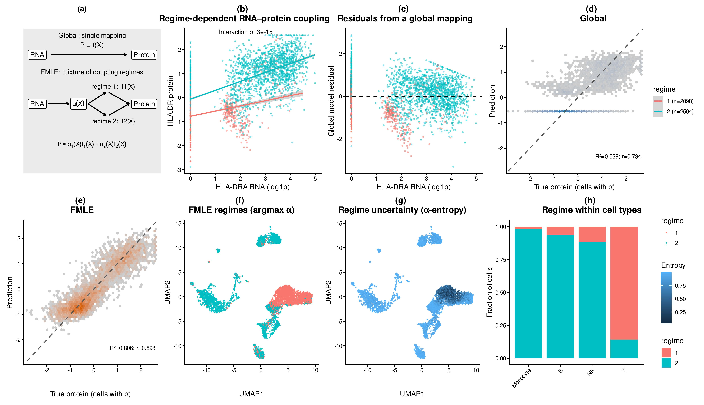
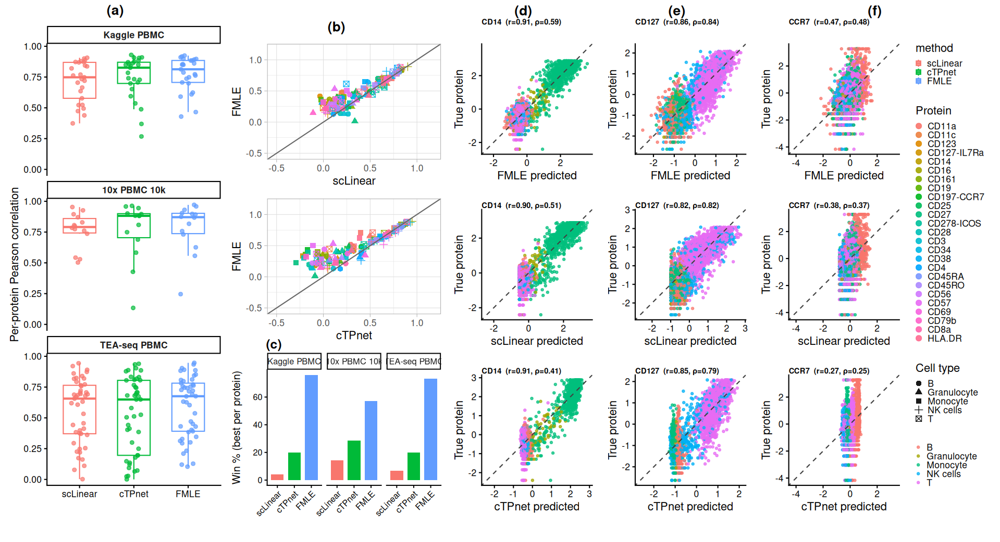
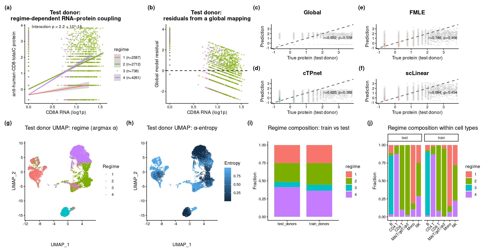

# FMLE

**FMLE** is an R package for regime-aware prediction of protein abundance from single-cell transcriptomic features using a fuzzy mixture of linear experts. It combines fuzzy c-means gating in a low-dimensional latent space with expert-specific linear predictors on high-dimensional gene expression features, enabling both interpretable and accurate protein prediction across heterogeneous cellular regimes.

The package supports:

- single-task prediction (`fmle_train()`, `fmle_predict()`)
- multi-task prediction (`fmle_train_mt()`, `fmle_predict_mt()`)
- cross-validation over the number of experts, fuzzifier, and L1 penalty (`fmle_cv_parallel()`, `fmle_cv_mt_parallel()`)
- fuzzy c-means gating (`fcm_fit()`)
- predictive uncertainty decomposition from the fitted experts

## Overview

FMLE models protein abundance as a mixture of regime-specific RNA–protein mappings with soft, input-dependent gating. This allows the model to capture heterogeneous coupling structure that is missed by a single global mapping.

<p align="center">
  
</p>

*Figure 1. FMLE identifies regime-dependent RNA–protein coupling, improves over a single global mapping, and reveals interpretable regime structure across cells.*

## Installation

```r
# install.packages("remotes")
remotes::install_local("FMLE")
# or
remotes::install_github("vikkyak/FMLE")
```


## Quickstart

The package ships with a tiny demo object for examples and the vignette.

## Single-task example
```r
library(FMLE)

demo <- readRDS(system.file("extdata", "fmle_demo.rds", package = "FMLE"))

X_train <- demo$X_train
X_test  <- demo$X_test
Y_train <- demo$Y_train
Y_test  <- demo$Y_test
Z_train <- demo$Z_train
Z_test  <- demo$Z_test
q <- 0.995

cap_and_scale_fit_local <- function(y, q = 0.995, eps = 1e-8) {
  cap <- as.numeric(stats::quantile(y, probs = q, na.rm = TRUE))
  y_cap <- pmin(y, cap)
  y_log <- log1p(y_cap + eps)
  mu <- mean(y_log, na.rm = TRUE)
  sd <- stats::sd(y_log, na.rm = TRUE)
  if (is.na(sd) || sd == 0) sd <- 1
  list(cap = cap, mu = mu, sd = sd, eps = eps)
}

cap_and_scale_apply_local <- function(y, tf) {
  y_cap <- pmin(y, tf$cap)
  y_log <- log1p(y_cap + tf$eps)
  (y_log - tf$mu) / tf$sd
}

tf_y <- cap_and_scale_fit_local(Y_train[, 1], q = q)
y_train <- cap_and_scale_apply_local(Y_train[, 1], tf_y)
y_test  <- cap_and_scale_apply_local(Y_test[, 1], tf_y)

cv <- fmle_cv_parallel(
  X = X_train,
  y = Y_train[, 1],
  Z = Z_train,
  R_grid = c(2, 3),
  m_grid = c(1.6, 1.8),
  lambda_grid = c(0, 1e-3),
  folds = 3,
  seed = 1,
  exec = "sequential",
  verbose = FALSE
)

best <- cv$best

fit <- fmle_train(
  X = X_train,
  y = y_train,
  Z = Z_train,
  R = best$R,
  m = best$m,
  lambda_l1 = best$lambda,
  ridge = 1e-6,
  standardize = TRUE,
  seed = 1
)

pred <- fmle_predict(
  model = fit,
  X_new = X_test,
  Z_new = Z_test,
  return_se = TRUE
)

pearson <- cor(pred$mean, y_test, method = "pearson")
spearman <- cor(pred$mean, y_test, method = "spearman")
mse <- mean((pred$mean - y_test)^2)

data.frame(
  metric = c("Pearson", "Spearman", "MSE"),
  value = c(pearson, spearman, mse)
)

```
## Benchmark summary

Across multiple PBMC datasets, FMLE improves RNA→protein prediction relative to scLinear and cTPnet.

<p align="center">  </p>

_Figure_ 2. FMLE achieves stronger per-protein predictive performance across benchmark datasets and wins more frequently than competing methods.

## Cross-donor generalization

FMLE preserves regime structure and predictive advantage under donor shift, supporting the biological reproducibility of the inferred coupling regimes.

<p align="center">  </p>

*_Figure_ 3. FMLE regimes generalize across donors, preserve structured RNA–protein coupling, and improve held-out donor prediction relative to global and baseline models.

## Vignette

- [Rendered quickstart vignette](doc/quickstart.html)
- [Vignette source](vignettes/quickstart.Rmd)

You can also browse installed package vignettes in R with:

```r
browseVignettes("FMLE")
```

## Important preprocessing note

For **single-task FMLE**, `fmle_cv_parallel()` internally applies cap/log/scale preprocessing to the response before fold-wise fitting and evaluation. In contrast, `fmle_train()` fits the response exactly as supplied.

After selecting `(R, m, lambda)` by cross-validation, refit the full model using the response scale you intend to use for the final model and evaluation.
